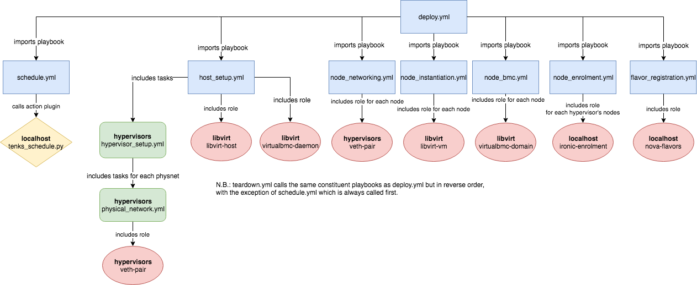

# Tenks

Tenks is a utility that manages virtual bare metal clusters for development and
testing purposes.

## Getting Started

### Pre-Requisites

Tenks has dependencies on Ansible roles that are hosted by Ansible Galaxy.
Given that your virtualenv of choice is active and Ansible (>=2.6) is
installed inside it, Tenks' role dependencies can be installed by
`ansible-galaxy install --role-file=requirements.yml
--roles-path=ansible/roles/`.

### Configuration

An override file should be created to configure Tenks. Any variables specified
in this file will take precedence over their default settings in Tenks. This
will allow you to set options as necessary for your setup, without needing to
directly modify Tenks' variable files. An example override file can be found
in `ansible/override.yml.example`.

Most of the configuration you will need to do relates to variables defined in
`ansible/host_vars/localhost`. You can set your own values for these in your
override file (mentioned above). In addition to other options, you will need to
define the types of node you'd like to be able to manage as a dict in
`node_types`, as well as the desired deployment specifications in `specs`.
Format and guidance for available options will be found within the variable
file.

Broadly, most variables in `ansible/group_vars/*` have sensible defaults which
may be left as-is unless you have a particular need to configure them. A
notable exception to this is the variable `physnet_mappings` in
`ansible/group_vars/hypervisors`, which should map physical network names to
the device to use for that network: this can be a network interface, or an
existing OVS or Linux bridge. If these mappings are the same for all hosts in
your `hypervisors` group, you may set a single dict `physnet_mappings` in your
overrides file, and this will be used for all hosts. If different mappings are
required for different hosts, you will need to individually specify them: for a
host with hostname *myhost*, set `physnet_mappings` within the file
`ansible/host_vars/myhost`.

### Commands

Tenks has a variable `cmd` which specifies the command to be run. This variable
can be set in your override file (see above). The possible values it can take
are:

* `deploy`: create a virtual cluster to the specification given. This is the
  default command.
* `teardown`: tear down any existing virtual cluster with the specification
  given.

### Running Tenks

Currently, Tenks does not have a CLI or wrapper. Deployment can be run by
calling `ansible-playbook --inventory ansible/inventory ansible/deploy.yml
--extra-vars=@override.yml`, where `override.yml` is the path to your override
file.

The `deploy.yml` playbook will run deployment from start to finish;
`teardown.yml` is `deploy.yml`'s "mirror image" to tear down a cluster. These
playbooks automatically set `cmd` appropriately, and they contain various
constituent playbooks which perform different parts of the deployment. An
individual section of Tenks can be run separately by substituting
`ansible/deploy.yml` in the command above with the path to the playbook(s) you
want to run. The current playbooks can be seen in the Ansible structure diagram
in the *Development* section. Bear in mind that you will have to set `cmd` in
your override file if you are running any of the sub-playbooks individually.

## Development

A diagram representing the Ansible structure of Tenks can be seen below. Blue
rectangles represent playbooks, green rounded rectangles represent task books,
red ellipses represent roles and yellow rhombi represent action plugins.

<!---
This diagram will need to be updated when the Ansible structure changes. The
original draw.io diagram can be found below. The link below contains the
diagram's XML which can be imported into draw.io and edited, then a new PNG
artifact can be produced.

https://drive.google.com/file/d/1MlmaTvJ2BPkhrOCLin4GPH265JDJqD1E/view?usp=sharing
-->

