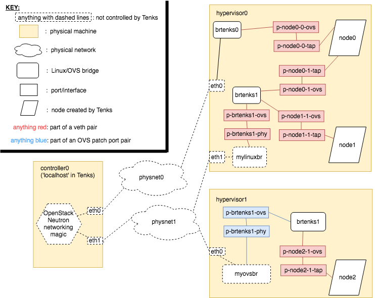

.. _architecture:

Architecture
============

Ansible
-------

A diagram representing the Ansible structure of Tenks can be seen below. Blue
rectangles represent playbooks, green rounded rectangles represent task books,
red ellipses represent roles and yellow rhombi represent action plugins.

.. This diagram will need to be updated when the Ansible structure changes. The
   original draw.io diagram can be found below. The link below contains the
   diagram's XML which can be imported into draw.io and edited, then a new PNG
   artifact can be produced.
   https://drive.google.com/file/d/1MlmaTvJ2BPkhrOCLin4GPH265JDJqD1E/view?usp=sharing

.. image:: images/tenks_ansible_structure.png
   :width: 100%

Networking
----------

Tenks has a concept of 'physical network' which currently must map one-to-one
to the hardware networks plugged into the hypervisors. It requires device
mappings to be specified on a hypervisor for each physical network that is to
be connected to nodes on that hypervisor. This device can be an interface, a
Linux bridge or an Open vSwitch bridge. For each physical network that is given
a mapping on a hypervisor, a new Tenks-managed Open vSwitch bridge is created.
If the device mapped to this physnet is an interface, it is plugged directly
into the new bridge. If the device is an existing Linux bridge, a veth pair is
created to connect the existing bridge to the new bridge. If the device is an
existing Open vSwitch bridge, an Open vSwitch patch port is created to link the
two bridges.

A new veth pair is created for each physical network that each node on each
hypervisor is connected to, and one end of the pair is plugged into the Tenks
Open vSwitch bridge for that physical network; the other end will be plugged
into the node itself.  Creation of these veth pairs is necessary (at least for
the Libvirt provider) to ensure that an interface is present in Open vSwitch
even when the node itself is powered off.

An example of the networking structure of Tenks is shown below. In this
example, one node was requested to be connected to physnet0 and physnet1, and
two nodes were requested to be connected just to physnet1.

